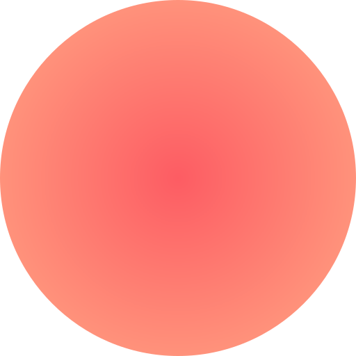

<!doctype html>
<html lang="en">
  <head>
    <!-- Required meta tags -->
    <meta charset="utf-8">
    <meta name="viewport" content="width=device-width, initial-scale=1, shrink-to-fit=no">
    
    <!-- Bootstrap CSS -->
    
    <link rel="stylesheet" href="https://unpkg.com/swiper/swiper-bundle.min.css">
    <link rel="stylesheet" href="//code.jquery.com/ui/1.12.1/themes/base/jquery-ui.css">
    <link rel="stylesheet" type="text/css" href="https://cdnjs.cloudflare.com/ajax/libs/font-awesome/5.15.3/css/all.min.css">
    <link rel="stylesheet" href="./css/select2.min.css">
    <link rel="stylesheet" href="./css/bootstrap.min.css" integrity="sha384-B0vP5xmATw1+K9KRQjQERJvTumQW0nPEzvF6L/Z6nronJ3oUOFUFpCjEUQouq2+l" crossorigin="anonymous">
    <link rel="stylesheet" href="./css/theme.css">

    <title>Apartments</title>
    
  </head>
  <body>
    <header>
      

      <nav class="navbar navbar-expand-lg">
        

          <a class="navbar-brand" href="#">DHH</a>
          <button class="navbar-toggler" type="button" data-toggle="collapse" data-target="#navbarSupportedContent" aria-controls="navbarSupportedContent" aria-expanded="false" aria-label="Toggle navigation">
            
              <svg xmlns="http://www.w3.org/2000/svg" viewBox="0 0 30 30"><path stroke="rgba(0, 0, 0, 0.5)" stroke-width="2" stroke-linecap="round" stroke-miterlimit="10" d="M4 7h22M4 15h22M4 23h22"/></svg>
            
          </button>
        

        

          

           <form class="form-inline my-lg-0">
            <input class="form-control mr-sm-2" type="search" placeholder="Search by distirict or area name" aria-label="Search">
          </form>
          

          

            <ul class="navbar-nav">
              <li class="nav-item ">
                <a class="nav-link" href="#">Monthly rentals(current)</a>
              </li>
              <li class="nav-item">
                <a class="nav-link" href="#">List a property</a>
              </li>
              <li class="nav-item">
                <a class="nav-link" href="#">Blog</a>
              </li>
            </ul>
            

              
              USD
              
              
            

          

        

      </nav>
      

    </header>
    <section class="banner-slider ">
      

        

          

            
          

          

            
          

          

            
          

          

            
          

          

            
          

          

            
          

          

            
          

          

            
          

          

            
          

          

            
          

        

        

        

      

      

        

          

            

              

                
                

              

              

                
                

              

              

                
                

              

              

                
                

              

              

                
                

              

              

                
                

              

              

                
                

              

              

                
                

              

              

                
                

              

              

                
                

              

            

          

          

              <button class="append-2-slides">+12 more</button>
          

        

      

    </section>
    <section class="blocks">
      

        

          

            

              Apartment
              <h2 class="title">Two floor villa with sea view</h2>
              Jumeirah Lake towers
              

                Two bedrooms•
                4 guests•
                1 bathroom•
                2 beds
              

              

                <h3 class="title">Description</h3>
                
Escape civilization to this incredible and peaceful getaway! Reconnect with nature and disconnect from technology on your own private deck surrounded by pristine and untouched nature just a short drive away from Jumeihra Lake Towers.

              

              

                

                  <h3>Facilities</h3>
                  <ul>
                    <li><i class="fas fa-car"></i>Air conditioning </li>
                    <li><i class="fas fa-car"></i>Parking</li>
                    <li><i class="fas fa-car"></i>Gym</li>
                    <li><i class="fas fa-car"></i>Essentials</li>
                    <li><i class="fas fa-car"></i>Kitchen</li>
                    <li><i class="fas fa-car"></i>Hair dryer</li>
                    <li><i class="fas fa-car"></i>Hangers</li>
                    <li><i class="fas fa-car"></i>Iron</li>
                    <li><i class="fas fa-car"></i>Elevator</li>
                    <li><i class="fas fa-car"></i>Pool</li>
                  </ul>
                

                

                  <h3>Extras(additional cost)</h3>
                  <ul>
                    <li><i class="fas fa-car"></i>Highchair</li>
                    <li><i class="fas fa-car"></i>Baby crib</li>
                    <li><i class="fas fa-car"></i>Extra bed</li>
                    <li><i class="fas fa-car"></i>Late check-in/out</li>
                    <li><i class="fas fa-car"></i>Extra keys/access card</li>
                    <li><i class="fas fa-car"></i>Extra cleaning days</li>
                  </ul>
                

              

            

            

              

                
Reviews from guests136

                

4.4

              

              

                
All reviews

                

                  

                  

                  

                  

                  

                

              

              

                

                  

                    

                      

                      

                        

                        
Andrew Lincoln

                        
September 2018  •  6 nights

                        

4

                      

                    

                    

4

                  

                  
Wonderful place! DnA were great host, the location, pool house, pool...amazing!

                

                

                  

                    

                      

                      

                        
Chris Hatfield

                        
September 2018  •  6 nights

                      

                    

                    

4

                  

                  
What an adventure! We misread the directions, got our Jeep stuck, walked down the hill hoping to find an ounce of service — but it was all so so worth it! Amazing view and weather - thank you Cassy (and Frank our lifesaver)! Well looking forward to be back.

                

                

                  

                    

                      

                      

                        
Hanna Montana

                        
September 2018  •  6 nights

                      

                    

                    

4

                  

                  
Truly a unique experience. Pictures don’t do this magical cliff top retreat justice. Very clean and easy to make a gourmet meal. This place is beautiful even in overcast weather. This is a must and will always be a great memory!

                

                <a href="#">
Show more
</a>
              

            

            
            
          

          

            

              
Book this apartment

              
From $117 per night

              <form>
                

                  <input type="text" class=" datepick" id="datepicker1">
                

                

                  <input type="text" class="datepick" id="datepicker2">
                

                <select class="guest" >
                  <option selected>2 guests</option>
                  <option value="1">2 guests</option>
                  <option value="2">3 guests</option>
                  <option value="3">4 guests</option>
                </select>
                

                  
7 nights

                  
$819

                

                
All fees and VAT already included

                <button type="submit" class="btn btn-primary">Submit</button>
              </form>
              
Change or cancel up to 24h prior to start, free

            

            

              

                <i class="fas fa-home"></i>
                

                  
Monthly price

                  
$1400

                

                
We provide special price for long-term rent, contact us if you interested in long stay booking

                
Request for a monthly rental

              

            

            

              
Share

              

                <a href="#">facebook</a>/
                <a href="#">twitter</a>/
                <a href="#">google+</a>/
                <a href="#">send a mail</a>/
              

            

          

        

      

    </section>
    <section class="property">
      

        

          

            Property rules
          

          

            <ul>
              <li>All DHH apartments was made with interior designers brews made</li>
              <li>24H support for guests, host support will help with any questions</li>
              <li>All DHH apartments was made with interior designers apartments was made</li>
              <li>All DHH apartments was made with interior designers brews made</li>
              <li>Shopping options range from small, quirky malls with homegrown</li>
            </ul>
          

        

      

    </section>
    <section class="area">
      

        

          
Disctrict and area

          

            
Seaside villa placed at Jumeirah Lake Towers, Jumeirah is a relaxed residential strip with sandy beaches like Jumeirah Public Beach, and guided tours at the white-stone Jumeirah Mosque. 

            
Shopping options range from small, quirky malls with homegrown fashion stores and indie coffee houses serving specialty brews, to upmarket complexes featuring international couture brands. Dubai Zoo is home to big cats, monkeys and reptiles.

          

          

            <h3 class="title">Features</h3>
            

              
Beach around  •  Close to the Metro  •  Zoo  •  Close to Burj Khalifa

              
<strong>200m</strong> to <strong>Mall of the Emirates</strong> station

            

            <iframe src="https://www.google.com/maps/embed?pb=!1m18!1m12!1m3!1d492485.53498906!2d73.73211209335938!3d15.347038036232696!2m3!1f0!2f0!3f0!3m2!1i1024!2i768!4f13.1!3m3!1m2!1s0x3bbfba106336b741%3A0xeaf887ff62f34092!2sGoa!5e0!3m2!1sen!2sin!4v1623249792035!5m2!1sen!2sin" width="600" height="450" style="border:0;" allowfullscreen="" loading="lazy"></iframe>
          

        

      

    </section>
    <section class="similar-partments">
      

        
Similar apartments

        

          

            

              

              

              

                
Two floor villa with ocean view

                
Jumeirah Lake Towers

                

                  
From $117 per night

                  

39

                

              

            

          

          

            

              

              

              

                
Two floor villa with ocean view

                
Jumeirah Lake Towers

                

                  
From $117 per night

                  

39

                

              

            

          

          

            

              

              

              

                
Two floor villa with ocean view

                
Jumeirah Lake Towers

                

                  
From $117 per night

                  

39

                

              

            

          

          

            

              

              

              

                
Two floor villa with ocean view

                
Jumeirah Lake Towers

                

                  
From $117 per night

                  

39

                

              

            

          

        

        
Explore all 38

      

    </section>

    <footer class="footer">
      

        

          

            

              <!--  -->
              <a href="#">DHH</a>
              
Best Homes and Prices

            

          

          

            

              
Driven Holiday Homes

              <ul>
                <li>About</li>
                <li>Rules</li>
                <li>FAQs</li>
                <li>Blog</li>
                <li>Careers</li>
                <li>Support</li> 
              </ul>
            

          

          

            

              
Currency

              USD
              

                
We’re at

                <a href="#">Booking.com</a>
                <a href="#">Airbnb.com</a>
              

            

          

          

            

              
Are you a landlord?

              <a href="#">List property</a>
            

          

          

            

              
Follow us 

              <a href="#" target="_blank">Booking.com</a>
              <a href="#" target="_blank">Airbnb.com</a>
              <a href="#" target="_blank">Booking.com</a>
            

          

          

            

              
Contact us

              <a href="#" target="_blank">hello@dhh.com</a>
            

          

        

        

            
Сopyright © 1996–2018 Driven Holiday Homes™. All rights reserved. <a href="#">Terms & Policies</a>

            
developed by tentwenty*

        

      

    </footer>

    <!-- Option 2: Separate Popper and Bootstrap JS -->
    
    
    
    
    
    
    
    
    
    
    
  </body>
</html>
